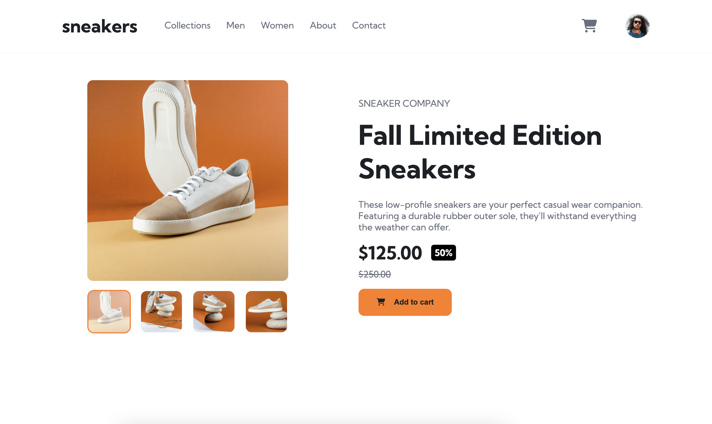

# Frontend Mentor - E-commerce product page solution

This is a solution to the [E-commerce product page challenge on Frontend Mentor](https://www.frontendmentor.io/challenges/ecommerce-product-page-UPsZ9MJp6). Frontend Mentor challenges help you improve your coding skills by building realistic projects.

## Table of contents

- [Frontend Mentor - E-commerce product page solution](#frontend-mentor---e-commerce-product-page-solution)
  - [Table of contents](#table-of-contents)
  - [Overview](#overview)
    - [The challenge](#the-challenge)
    - [Screenshot](#screenshot)
    - [Links](#links)
  - [My process](#my-process)
    - [Built with](#built-with)
    - [What I learned](#what-i-learned)
      - [Consistent Data and Function Usage](#consistent-data-and-function-usage)
      - [Modular and Reusable Components](#modular-and-reusable-components)
  - [Author](#author)

## Overview

### The challenge

Users should be able to:

- View the optimal layout for the site depending on their device's screen size
- See hover states for all interactive elements on the page
- Open a lightbox gallery by clicking on the large product image
- Switch the large product image by clicking on the small thumbnail images
- Add items to the cart
- View the cart and remove items from it

### Screenshot




### Links

- Solution URL: [https://product-page-ads.pages.dev/](https://product-page-ads.pages.dev/)
- Live Site URL: [https://product-page-ads.pages.dev/](https://product-page-ads.pages.dev/)

## My process

### Built with

- Semantic HTML5 markup
- CSS custom properties
- Flexbox
- Mobile-first workflow
- [React](https://reactjs.org/) - JS library
- [TypeScript](https://www.typescriptlang.org/) - Type Syntax for JavaScript
- [FontAwesome Icons](https://fontawesome.com/) - Icon library and toolkit
- [Vite](https://vite.dev/) - Frontend built tool

### What I learned

#### Consistent Data and Function Usage

I approached this project with the idea of developing the page as if it were part of a larger app and were receiving date from an remote API or backend database. To this end, I used TypeScript to define a Product type that would help provide consistency in how product data was accessed and used.

```typescript
// src/types/product.d.ts
export type Product = {
  product_name: string;
  product_desc: string;
  price_usd: number;
  sale_usd: number | null;
  images: { [key: string]: { main: string; thumbnail: string } };
};
```

I also defined types for the project's cart state that helped provide structure to this important data. Types in `cart.d.ts` outline a cart items, the cart, and a function to update the cart.

```typescript
// src/types/cart.d.ts
export type cartItem = {
  name: string;
  price: number;
  quantity: number;
  image: string;
};

export type Cart = cartItem[];

export type cartUpdater = (
  action: 'add' | 'increment' | 'decrement',
  item: { name: string; price: number; image: string }
) => void;
```

These are used throughout the project to provide consistency as state and state updating function are passed between components. For example, the below function is defined to help update the cart state (contained in App.tsx) from ActionButtons.tsx which is several children down the component tree.

```typescript
// src/App.tsx
const updateCart: cartUpdater = (action, item) => {
  if (action === 'add') {
    const newCart = [...cart];
    newCart.push({ ...item, quantity: 1 });
    setCart(newCart);
  }

  if (action === 'increment') {
    const newCart = [...cart];
    const index = newCart.findIndex((element) => element.name === item.name);
    newCart[index].quantity++;
    setCart(newCart);
  }

  if (action === 'decrement') {
    const newCart = [...cart];
    const index = newCart.findIndex((element) => element.name === item.name);

    if (newCart[index].quantity > 1) {
      newCart[index].quantity--;
    } else {
      newCart.splice(index, 1);
    }

    setCart(newCart);
  }
};
```

The ActionButtons.tsx component then has defined props that include a `cartUpdater` function.

```typescript
// src/components/ActionButton.tsx
type ActionButtonsProps = {
  product: Product;
  cart: Cart;
  updateCart: cartUpdater;
};
```

#### Modular and Reusable Components

Another goal I had while working on this project was to create modular and reusable components that could be used throughout the project in a range of situations and in a variety of ways. The best example of this is the image viewer that required to be rendered in three general ways depending on component placement and screen width.

- Needs clickable arrows to change images when inside a lightbox
- Needs clickable arrows on mobile
- Needs a function to open a lightbox only when rendered on the product page and not when inside a lightbox

To achieve this, I made use of optional props that are used to add or remove the needed elements and function in different situations.

```typescript
type ImageViewerProps = {
  images: Product['images'];
  activeImage: string;
  setActiveImage: (image: string) => void;
  openLightBox?: () => void;
  hasArrows?: boolean;
};
```

I then used the optional props to override styles and define functions in varying ways.

```typescript
const arrowStyles = hasArrows ? { display: 'block' } : {};
```

```typescript
onClick={openLightBox ? openLightBox : () => null}
```

## Author

- Website - [James Spears](http://jspears.m)
- Frontend Mentor - [@jamesspearsv](https://www.frontendmentor.io/profile/jamesspearsv)
